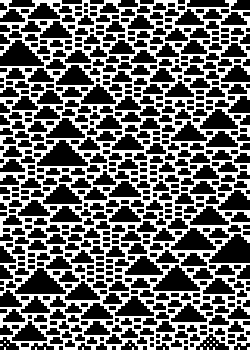
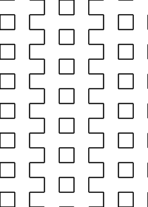

# Paper Toaster (Thermal Receipt Printer Art) (2022-2024)


<!-- (Banner generated with these args:)
```
--num-cards 3 --landscape hitomezashi -o -s 0.125 6121365253313453 644235452426624254532446
```
-->

This repo is for generative art with PostScript output that can be printed
to standard 3 1/8 inch (80 mm) thermal receipt paper. I personally use [this 
Rongta point-of-sale (POS) printer](https://www.amazon.com/gp/product/B08V4H7T47/ref=ppx_yo_dt_b_search_asin_title?ie=UTF8&psc=1) to print my artwork. For example,
here is the same banner above printed out:

<div style="text-align: center;">
    
</div>

I like to make my art at art trading card size (2.5 x 3.5 in), so this code is
designed around that. This size is conveniently just a little bit narrower
than the paper, so it pairs well.

I jokingly refer to my receipt printer as a "paper toaster" since a thermal
printer works by heating the thermal paper, darkening it. No ink is used.

## Dependencies

[GhostScript](https://www.ghostscript.com/) must be installed for PDF and PNG exports to work

## Usage

### Set the working directory

To make integration with Docker easier, files are always written to the directory
specified by the environment `WORK_DIR`. This also lets you set the directory
once instead of having to repeat it every command.

```bash
# bash
export OUTPUT_DIR="/path/to/workdir"
```

### Run the script

in the `src` directory, there's a `papertoaster` module. Executing this
module 

```bash
cd src

# Generate the postscript file in /<artwork_id>.ps
# see -h for options. 
python -m papertoaster [global_options] <artwork_id> -- [artwork_options]
```

The output documents are written to `$WORK_DIR/<artwork_id>_*`. This includes:

* `$WORK_DIR.ps` - The PostScript file generated by the script

For PDF/PNG output, see [Post-processing](#post-processing) below.

## Docker

### Running in a container

```
# Run Paper Toaster in a container
docker container run -v /your/path/here:/workdir --rm -it ptrgags/paper-toaster [<arg>, <arg>, ...]

# Generate a PDF and PNG images from the postscript file (optional)
docker container run -v /your/path/here:/workdir --rm -it ptrgags/post-toast-ghost <arwork_id>.ps
```

### Building the images

```sh
# from the repo root

# Base image paper-toaster
docker image build -f ./docker/Dockerfile --target paper-toaster -t paper-toaster .

# Ghostscript image converter, post-toast-ghost
docker image build -f ./docker/Dockerfile --target post-toast-ghost -t post-toast-ghost .
```

### Global Options

There are a few options that can be used with any artwork to control the page
size and layout. However, some artworks may be designed for specific
configurations, such as one trading-card sized page.

:warning: These options must go before the subcommand!
E.g. `python -m papertoaster --seed 100 robot_walks` works, but not
`python -m papertoaster robot_walks --seed 100`.

| Option | Description |
| --- | --- |
| `--num-cards N` | How many 2.5x3.5 inch trading cards tall will the receipt be. For example, I sometimes print receipts that are 3 cards tall. |
| `--page-width WIDTH_INCHES` | Override the width of the page to be any size in inches. |
| `--page-height HEIGHT_INCHES` | Override the height of the page to be any size in inches. |
| `--landscape` | Make the ouput document landscape rather than portrait. |
| `--seed SEED` | If provided, random.seed() will be called with this value to make the results reproducible. Otherwise, a seed will be chosen automatically and printed to the console. |

## Post-processing

Often I want to convert the PostScript file to a PDF (I find this easier to 
print on my system) and PNG images. This can be done with GhostScript, though
the commands have slightly different names in Windows

Example in Linux:

```sh
# Generate a PDF
ps2pdf input.ps

# Generate a PNG image at 300 DPI
gs -o output.png -sDEVICE=png16m -r300 input.ps
```

### Docker Post-processing

This repo also provides 


* `<artwork_id>.pdf` - (Requires GhostScript) a PDF version of the document. I find this to be the easiest to use for printing
* `<artwork_id>_web.png` - (Requires GhostScript) a PNG version at 200 DPI. I use this to make larger screenshots for my website.
* `<artwork_id>_thumbnail.png` - (Requires GhostScript) a PNG version at 100 DPI. I use this for thumbnails in the README and on my website.

## Logbook

As with many of my projects, I keep a log of what I worked on over time. This
includes notes, experiments, links to resources I used along the way, etc.

You can find it here:

[Logbook](logbook.md)

## Artworks

The sections below give a summary of the different artworks and explain the
parameters. They are listed in reverse chronological order to feature newest
artworks at the top.

Examples marked with :test_tube: indicate artistic experiments by messing
with the parameters in ways I didn't originally intend.

Examples with a Seed column can be reproduced exactly using the `--seed N`
global option to set the random seed.

<!--

Template!

### PROJECT_NAME (YYYY-MM-DD)

DESCRIPTION

**Parameters:**

| Parameter | Description |
|---|---|

**Examples:**

| Example | Arguments | Description |
|---|---|---|

-->

### Robot Walks (2024-06-10)

This receipt creates patterns inspired by the Project Euler [problem #208: Robot Walks](https://projecteuler.net/problem=208). This script does not solve the puzzle, but it
does visualize some of the paths. This script produces two types of paths:

1. Looping paths with 5-fold symmetry (most of the time)
2. Infinitely repeating paths (sometimes)

There are more possibilities, but these ones have more symmetry.

**Parameters:**

| Parameter | Description |
|---|---|
| `-n/--num-steps N` | How many steps the robot will take. The path will be repeated 5 times as this usually causes the robot to loop back to the start. |
| `-l/--loop` | If set, the script will keep trying until it finds a path that loops. |
| `-d/--dots` | If set, draw a dot at each position on the robot's path. |
| `-p/--path-type {arc, polyline}` | Select between curved arcs and straight polylines. |
| `-r/--render-type {stroke,fill,eofill}` | Select between stroked, filled, or even-odd filled paths. |

**Examples:**

| Example | Arguments | Description | Seed |
|---|---|---|---|
|  | `robot_walks` | Generate a random pattern. | 9422 |
| | `robot_walks --dots` | Draw dots at each step. | 9308 |
|  | `robot_walks --loop` | Disallow infinite paths. | 9080 |
| | `robot_walks -n 100` | Make the robot path much longer. Note that this path didn't loop. | 3766 |
|  | `robot_walks -p polyline` | Use polylines to give a different appearance. | 8916 |
|  | `robot_walks -r eofill` | Use even-odd fill. | 8790 |
|  | `robot_walks -n 30 -p polyline -r eofill` | :test_tube: Combining several options. | 9762 |
|  | `robot_walks -n 30 -r eofill` | :test_tube: Another mix of parameters. | 9866 |
|  | `robot_walks -n 100 -r eofill` | :test_tube: Same seed as the previous example, but different settings. | 9866 |

### To Do List (2023-01-28)

This receipt is more of a utility than an artwork. It simply draws a to do
list template with checkboxes that you can print out and write on. It's also
nice for a shopping list!

**Parameters:**

| Parameter | Description |
|---|---|
| `-s/--row-size` | Size of a row in inches (including padding). Defaults to 1/4 inch |

**Examples:**

| Example | Arguments | Description |
|---|---|---|
|  | `todo` | Default settings

### Edge Direction Tiling (2022-09-03)

This tiling was an artistic way of visualizing flow in a grid.

First, a grid of cells is created. Then, for each edge between cells, a
direction across the edge is chosen randomly. Then, for each cell, based
on which directions the flow in/out of the tile is going, one of several
tiles is chosen. 

Randomly placing the tiles would be an easier implementation, but this method
ensures that if you follow any path from a source (closed circle) to a sink
(open circle), the flow direction will look consistent.

**Parameters:**

| Parameter | Description |
|---|---|
| `-s/--square-size SQUARE_SIZE` | The size of each grid square. Defaults to 1/4 inch |

**Examples:**

| Example | Arguments | Description |
|---|---|---|
|  | `edge_directions` | Simple example |
|  | `edge_directions -s 0.125` | Set the square size to 1/8 of an inch |

### Colored Braids (2022-08-23)

A colorized version of the older `braids` tiling. Obviously, this looks better
on a screen or a color printer rather than the grayscale of a receipt printer.

**Parameters:**

| Parameter | Description |
|---|---|
| `-s/--square-size SQUARE_SIZE` | The size of each grid square. Defaults to 1/4 inch |
| `-w/--stroke-width WIDTH_POINTS` | The width of a single strand in points (1/72 of an inch) |
| `-c/--swap-chance CHANCE` | The chance of swapping a braid strand with its neighbor as a number between 0.0 and 1.0 |
| `-i/--invert-colors` | Invert the colors so the braids stand out |
| `-g/--groups GROUPS_CSV` | CSV of positive integers the determines groups of strands to weave. E.g. `3,4` means weave the first 3 strands, and the next 4 strands separately. If not specified, all strands are woven. If there are not enough groups for the number of strands, the list of groups will be repeated |

**Examples:**

| Example | Arguments | Description |
|---|---|---|
|  | `colored_braids` | Default settings |
|  | `colored_braids -i` | Inverted colors help the braids stand out |
| | `colored_braids -i -c 1.0` | Force the braid to make every possible crossing |
|  | `colored_braids -i -g 3,2` | Group stands into groups of 3 and groups of 2. |

### Iso Grid (2022-07-24)

I've always liked the look of isometric grids in video games and art, so this
artwork makes a mountain-like scene on an isometric grid.

The scene is an illusion. I'm just overlaying a bunch of solid-color
parallelograms from back to front to make the scene. This is somewhat inspired
by 2D tile-based iso rendering, but much simpler to implement. Of course, it
only works well for this carefully curated scene.

To make the mountain shape, I randomly generate heights in each cell such that
a cell is equal or taller than any of its neighbors closer to the "camera".

**Parameters:**

This script generates a random isometric scene each time. There are no
parameters.

**Examples:**

| Example | Arguments |
|---|---|
|  | `iso_grid` |
|  | `iso_grid` |

### Braids (2022-07-24)

A pattern of strands of rope being woven together in a braid pattern.
The crossings are randomly chosen.

**Parameters:**

| Parameter | Description |
|---|---|
| `-s/--square-size SQUARE_SIZE` | The size of each grid square. Defaults to 1/4 inch |
| `-i/--invert-colors` | If true, invert the color scheme |

**Examples:**

| Example | Arguments | Description |
|---|---|---|
|  | `braids` | Default settings |
|  | `braids -i` | Inverted colors |

### Elementary Cellular Automaton (2022-07-09)

This script is a simple implementation of an [elementary cellular automaton](https://mathworld.wolfram.com/ElementaryCellularAutomaton.html).

There are a few differences from the description on Wolfram Mathworld:

1. Instead of starting from a single seed point, the first row is randomly generated
2. When examining neighbors, this script wraps around the boundary
3. The pattern is generated from bottom to top given PostScript's coordinate system

**Parameters:**

| Parameter | Description |
|---|---|
| `RULE` | The rule number from 0 to 255 |

**Examples:**

| Example | Arguments | Description |
|---|---|---|
|  | `elementary_ca 30` | Rule 30. This pattern is chaotic and is like a simplified model for the patterns on sea snail shells (see [_Olivia porphria_](https://en.wikipedia.org/wiki/Oliva_porphyria)) |
|  | `elementary_ca 112` | Rule 112 |
|  | `elementary_ca 161` | Rule 161 |

### Code 128 Barcodes (2022-07-03)

Barcodes are ubiquitous, but I didn't know much about how they encode data.
So I tried implementing [Code 128 barcodes](https://en.wikipedia.org/wiki/Code_128)
since these can store not just numbers but ASCII characters too.

This receipt works best with the `--landscape` global option, and for longer
strings of text, increasing the `--num-cards` is necessary.

Also note that barcodes are easier to scan on paper than on a screen, and
it works best when the barcode is flat. I'm able to use my Android phone's
camera to scan it, but sometimes third-party apps are necessary.

**Parameters:**

| Parameter | Description |
|---|---|
| `TEXT` | An ASCII string to turn into a barcode |

**Examples:**

| Example | Arguments | Description |
|---|---|---|
|  | `--landscape barcode128 "Paper Toaster"` | Simple example that encodes the text "Paper Toaster" |

### Turtle Dances (2022-06-27)

[Turtle graphics](https://en.wikipedia.org/wiki/Turtle_graphics) patterns based on the Bridges math art paper ["Let the Numbers Do the Walking: Generating Turtle Dances on the Plane from Integer Sequences"](https://archive.bridgesmathart.org/2017/bridges2017-139.pdf)

This implementation allows using different sequences of integers:

* The natural numbers
* The square numbers
* The triangle numbers
* The fibonnaci sequence

**Parameters:**

| Parameter | Description |
|---|---|
| `SEQUENCE` | One of `natural`, `square`, `triangle`, `fibonacci` |
| `A` | The first integer modulus |
| `B` | The second integer modulus |
| `-d/--divisions` | A divisor of 360 degrees used to determine the minimum turn angle. |
| `-f/--fill` | If set, the path will be filled with odd/even fill |

**Examples:**

| Example | Arguments | Description |
|---|---|---|
|  | `turtle_dance natural 70 80` | Basic example
|  | `turtle_dance square 360 46 --divisions 12` | Example where the minimum turn angle is 1/12 of a turn |
|  | `turtle_dance fibonacci 90 45 --fill` | Example of odd/even filling |

### Quiet Dice (2022-06-20)

Sometimes I want a large number of dice rolls (e.g. for drawing dice-generated
art on paper), but rolling that many dice would be inconvenient (because it
would be tedious, noisy, or I don't have dice on hand).

Certainly it's easy to find apps to do dice rolls, but sometimes I want to get
away from my phone. So it would be handy to roll many dice up front, then
cross off entries from the list as I use them.

This script simply generates a bunch of dice rolls of the form (NdX + M) in
[standard dice notation](https://en.wikipedia.org/wiki/Dice_notation#Standard_notation)
and prints them out in a table.

**Parameters:**

| Parameter | Description |
|---|---|
| `N` | (required) How many dice are summed for each roll. For example, 2 would mean roll two dice and add their results |
| `SIDES` | (required) Each die rolled will have this many sides. |
| `-m/--modifier MODIFIER` | A constant value to add to the result. |

**Examples:**

| Example | Arguments | Description |
|---|---|---|
|  | `quiet_dice 1 6` | Simple example |
|  | `quiet_dice 2 10` | Example where each roll adds two 10-sided dice. |
|  | `quiet_dice 1 20 -m 2` | Example with a modifier |

### Hitomezashi (2022-06-17)

This artwork is based on Hitomezashi embroidery patterns, inspired by
[this Numberphile video](https://www.youtube.com/watch?v=JbfhzlMk2eY). Hitomezashi
is a form of [Sashiko embroidery](https://en.wikipedia.org/wiki/Sashiko),
decorative running stitch patterns that help reinforce clothing.

This script lets you specify two integers to set the bit pattern for the
rows and columns (see the video to see how this works). Large numbers with
a variety of 1s and 0s work best.

**Parameters:**

| Parameter | Description |
|---|---|
| `ROW_BITS` | An integer representing the bits for the rows (least significant bit first). It can be a decimal number or a binary number prefixed with `0b`. Rows are numbered from bottom to top of the document. |
| `COL_BITS` | An integer representing the bits for the columns (least significant bit first). It can be a decimal number or a binary number prefixed with `0b`. Columns are numbered from left to right. |
| `-o/--odd-even` | If true, the pattern is filled with an odd/even coloring. |
| `-s/--square-size` | Size of each square in inches. Defaults to a quarter of an inch |

**Examples:**

| Example | Arguments | Description |
|---|---|---|
|  | `hitomezashi 0 0` | The simplest possible example. Since all the bits are zero, you get a repeated pattern of squares. Note that the bottom left corner has a stitch in both directions
|  | `hitomezashi 0 0b1111000` | Since bits are read LSB-first, this shifts columns 3, 4, 5, and 6 |
|  | `hitomezashi 123456 101010` | Here I'm just typing patterns in decimal, the actual binary strings are different |
|  | `hitomezashi -o 123456 101010` | Same as the previous example, but with odd-even coloring turned on |
|  | `hitomezashi -s 0.125 12345678910 0b11001100110011001100` | Set the square size smaller. Note that I needed to use larger numbers to have enough bits | 
|  | `hitomezashi -s 0.125 -o 465665232252 252232566564` | :test_tube: I rolled 12d6 to pick the digits, but entered it in reverse order for the columns |
|  | `hitomezashi -o -s 0.125 0b10110111011110111110111110 0b010010101111010100100` | :test_tube: The digits for the rows are 10, 110, 1110, 11110 concatenated. The column digits are a pattern with mirror symmetry. |
|  | `hitomezashi -o 0b10101010101010101010 0b010101010101` | :test_tube: alternating bits produces a stair-step pattern. Changing the final bit reverses the pattern in each direction | 

### Hex Grid (2022-06-15)

Hex grid with some optional gaps between hexagons. It also can render dots
instead of lines.

This artwork only supports a single card-length receipt.

**Parameters:**

| Parameter | Description |
|---|---|
| `-s/--side-length SIDE_LENGTH` | The side length of each hexagon in inches. Defaults to 1/4 inch |
| `-e/--expand-factor EXPAND_FACTOR` | How much to expand/contract the grid for artistic effect |
| `-d/--dots` | Draw the hexagon vertices, but do not connect them. This can be used to make a hex grid  |

**Examples:**

| Example | Arguments | Description |
|---|---|---|
|  | `hex_grid` | Default settings |
|  | `hex_grid -e 1.2` | Increase the expand factor to create gaps between the hexagons |
|  | `hex_grid --dots` | Just render a hexagon grid with just dots|
|  | `hex_grid -e 0.8` | :test_tube: Decrease the expand factor to make the hexagons overlap for neat effect |
|  | `hex_grid --dots -e 0.8` | :test_tube: Turn on dots, but also contract the hexagons like the overlap case |

### Grid (2022-06-15)

This was a warm-up exercise, this makes a card with graph paper.

**Parameters:**

| Parameter | Description |
|---|---|
| `-s/--square-size SQUARE_SIZE` | The size of each grid square. Defaults to 1/4 inch |

**Examples:**

| Example | Arguments | Description |
| --- | --- | --- | 
|  | `grid` | Default settings (1/4 inch grid when printed)
|  | `grid -s 0.125` | finer 1/8 inch grid |

